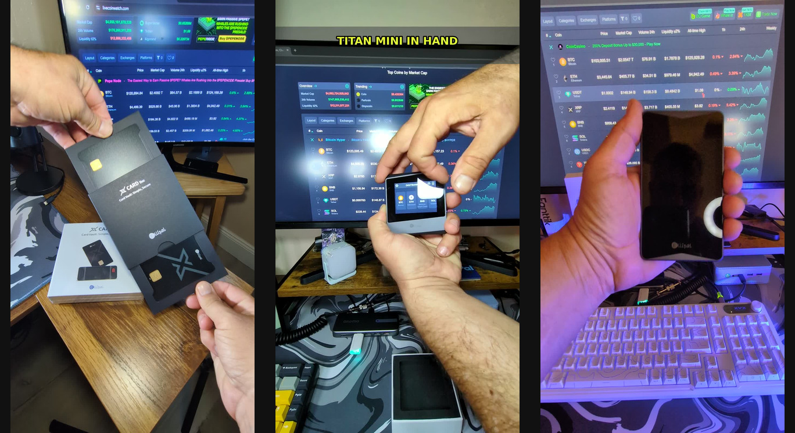
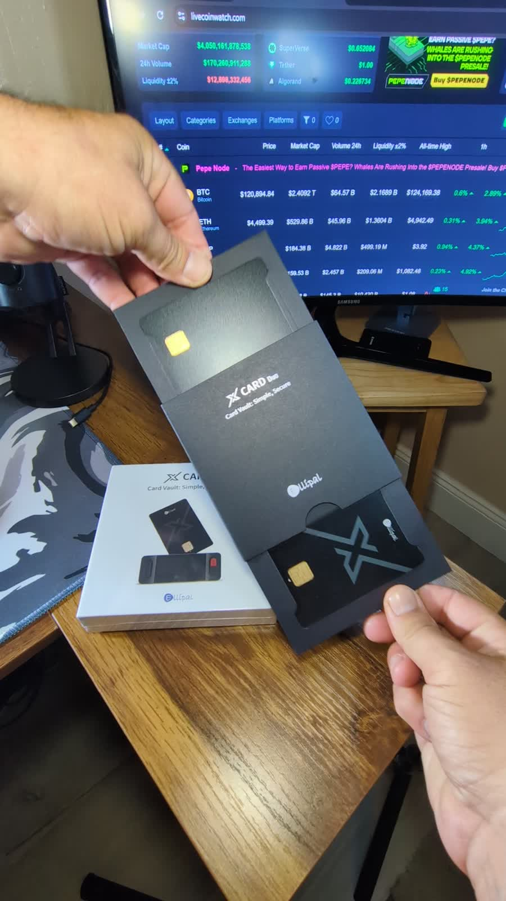
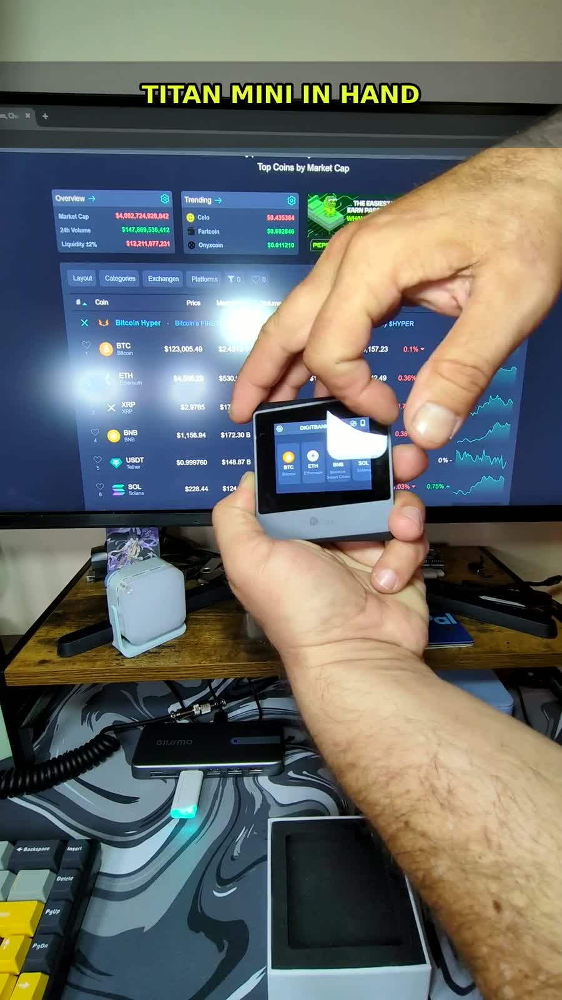
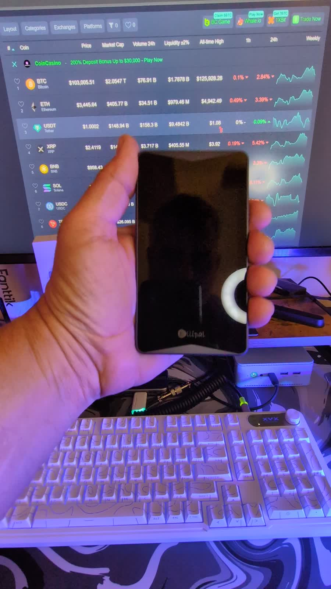

# Forbes Keeps Pointing Back To The Same Cold-Wallet Question

_ELLIPAL X Card, Titan Mini, and Titan 2.0 are not the same device. They are three different answers to one self-custody problem: who controls the keys?_

Forbes and Forbes Advisor keep circling the same point in their crypto-wallet coverage: the wallet choice is not just about where you click buy, it is about where the private keys live.

The most relevant clip for ELLIPAL shoppers is Forbes Advisor Australia's best crypto wallets roundup, which lists an ELLIPAL Titan hardware wallet entry and calls out the air-gapped approach: no Bluetooth, Wi-Fi, USB data connection, NFC, or network connection in the signing path. Forbes Advisor India also describes the ELLIPAL Titan lane as a QR-code hardware wallet approach that avoids the usual USB or Bluetooth connection model.

That does not mean every ELLIPAL product is the right fit for every person. It does mean ELLIPAL belongs in the comparison when someone is moving from exchange custody into actual cold storage.

Start with the Forbes reads:

- [Forbes Advisor AU: Best Crypto Wallets For Australians](https://www.forbes.com/advisor/au/investing/cryptocurrency/best-crypto-wallets-for-australians/)
- [Forbes Advisor India: Best Crypto Wallets In India](https://www.forbes.com/advisor/in/investing/cryptocurrency/best-crypto-wallets/)
- [ELLIPAL official site, with Forbes Advisor recognition shown on the homepage](https://www.ellipal.com/)

## The Forbes Angle

The useful takeaway from the Forbes Advisor coverage is not "buy the first wallet you see." It is this: cold wallets are a process choice.

Hot wallets and exchange accounts are convenient. They are also connected. A cold-wallet setup changes the workflow by keeping the signing device offline and forcing the approval step onto hardware you physically control.

That is where ELLIPAL's Titan-style QR flow gets attention. The phone app can prepare a transaction, but the device signs through QR codes while the private keys stay isolated on the wallet. Forbes Advisor AU notes both the upside and the tradeoffs: air-gapped design, broad asset support, and competitive pricing on one side; support and device-size caveats on the other.

That is a fair way to look at it. Hardware wallets are not magic. They are discipline in product form.

## The Three ELLIPAL Shapes

### ELLIPAL X Card

The X Card is the pocket-carry version of the idea: a slim NFC cold wallet that feels more like a card than a vault device. ELLIPAL positions it around card-sized portability, offline setup, NFC tap-to-sign use, no battery, and an EAL6+ secure chip.

Watch the Digital Donkey clip: [ELLIPAL X Card TikTok video](https://www.tiktok.com/@donkey.digital/video/7660881364815744286)

Product reference: [ELLIPAL X Card official page](https://www.ellipal.com/products/ellipal-x-card)

### ELLIPAL Titan Mini

The Titan Mini is the compact air-gapped touchscreen lane. It is for someone who wants a physical screen, QR signing, and a more traditional hardware-wallet feel without carrying the larger Titan body.

ELLIPAL lists the Mini with offline QR transaction signing, a metal anti-tamper body, a 2.7-inch color touchscreen, hidden-wallet support, and broad coin/token support.

Watch the Digital Donkey clip: [ELLIPAL Titan Mini TikTok video](https://www.tiktok.com/@donkey.digital/video/7660894078590061855)

Product reference: [ELLIPAL Titan Mini official page](https://www.ellipal.com/products/ellipal-titan-mini)

### ELLIPAL Titan 2.0

The Titan 2.0 is the bigger home-vault style option. It leans into the full air-gapped story: QR-code signing, no Wi-Fi, no Bluetooth, no USB data connection, a full-metal sealed body, a 4-inch touchscreen, and clear signing so the user can review what is being approved.

This is the one I would look at if the priority is deliberate signing and a larger screen over maximum portability.

Watch the Digital Donkey clip: [ELLIPAL Titan 2.0 TikTok video](https://www.tiktok.com/@donkey.digital/video/7660894658158923038)

Product reference: [ELLIPAL Titan 2.0 official page](https://www.ellipal.com/products/ellipal-titan)

## How I Would Use The Forbes Mentions

I would not treat a Forbes mention like a permission slip to skip research. I would treat it like a filter.

If your crypto is still sitting on an exchange because "you will move it later," then the first question is not which ELLIPAL to buy. The first question is whether you actually want self-custody and will handle the responsibility that comes with it.

Once the answer is yes, the product decision gets simpler:

- Choose [X Card](https://www.ellipal.com/products/ellipal-x-card) if you want the smallest, daily-carry style cold-wallet format.
- Choose [Titan Mini](https://www.ellipal.com/products/ellipal-titan-mini) if you want compact QR-signing hardware with a screen.
- Choose [Titan 2.0](https://www.ellipal.com/products/ellipal-titan) if you want the larger touchscreen, metal-body, home-vault style device.

Then do the boring parts correctly:

- Send a small test transaction first.
- Keep seed phrases offline.
- Do not put recovery words in screenshots, notes apps, cloud drives, or photos.
- Verify receive addresses on the device screen, not just on the phone.
- Slow down before approvals. Most wallet mistakes happen when people rush.

Cold storage is not about looking more serious. It is about removing unnecessary trust from the stack.

Disclosure: Digital Donkey TikTok Shop links and product links may route through affiliate or commerce surfaces. This is educational content, not financial advice.

